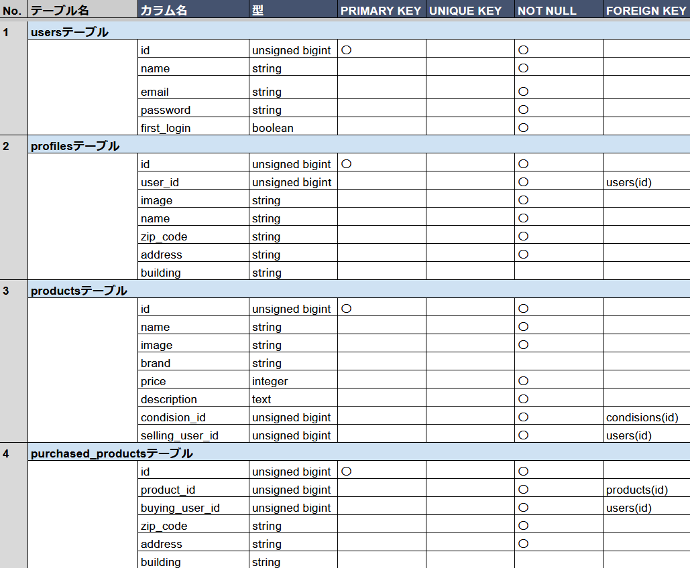
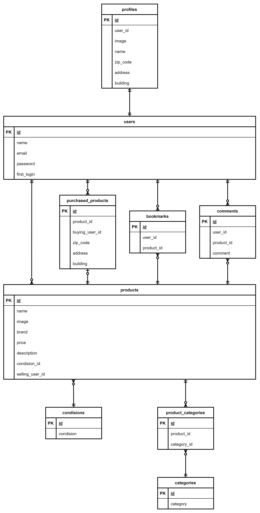

# COACHTECHフリマ
商品を出品することができ、ほかの人が出品した商品を閲覧、購入することができる  
お気に入り機能とコメント機能が付いている

## トップ画面


## URL
- 開発環境：http://localhost/
- phpMyAdmin:：http://localhost:8080/

## テストユーザー
| ユーザー名 | メールアドレス | パスワード | 
| ---------- | -------------- | ---------- | 
| 一郎       | ichiro@example | password   | 
| 二郎       | jiro@example   | password   | 
| 三郎       | saburo@example | password   | 
| 四郎       | shiro@example  | password   | 
| 五郎       | goro@example   | password   | 

## 機能一覧
- 会員登録
- プロフィール登録
- ログイン
- 商品一覧画面の表示
- 商品詳細画面の表示
- 商品のお気に入り登録
- 商品へのコメント
- 商品の購入
- マイページの表示
- プロフィール編集
- 商品の出品


## 使用技術(実行環境)
- PHP8.3.0
- Laravel8.83.27
- MySQL8.0.26

## テーブル設計



## ER図


# 環境構築
**Dockerビルド**
1. `git clone git@github.com:matashi163/coachtech-resale.git`
2. DockerDesktopアプリを立ち上げる
3. `docker-compose up -d --build`

> *MacのM1・M2チップのPCの場合、`no matching manifest for linux/arm64/v8 in the manifest list entries`のメッセージが表示されビルドができないことがあります。
エラーが発生する場合は、docker-compose.ymlファイルの「mysql」内に「platform」の項目を追加で記載してください*
``` bash
mysql:
    platform: linux/x86_64(この文追加)
    image: mysql:8.0.26
    environment:
```

**Laravel環境構築**
1. `docker-compose exec php bash`
2. `composer install`
3. 「.env.example」ファイルを 「.env」ファイルに命名を変更。または、新しく.envファイルを作成
4. .envに以下の環境変数を追加
``` text
DB_CONNECTION=mysql
DB_HOST=mysql
DB_PORT=3306
DB_DATABASE=laravel_db
DB_USERNAME=laravel_user
DB_PASSWORD=laravel_pass
```
5. アプリケーションキーの作成
``` bash
php artisan key:generate
```

6. マイグレーションの実行
``` bash
php artisan migrate
```

7. シーディングの実行
``` bash
php artisan db:seed
```

8. シンボリックリンク作成
``` bash
php artisan storage:link
```